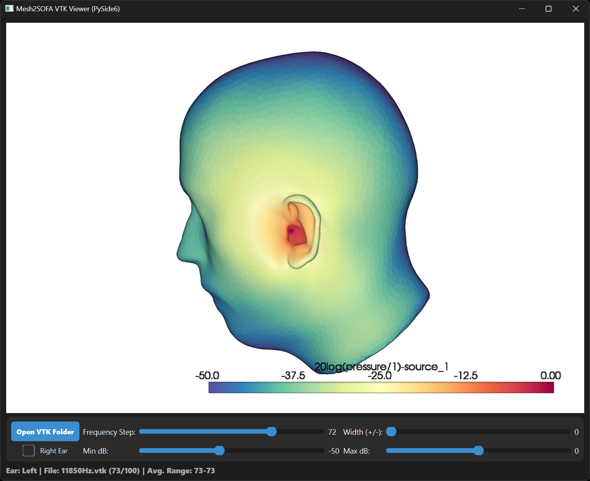
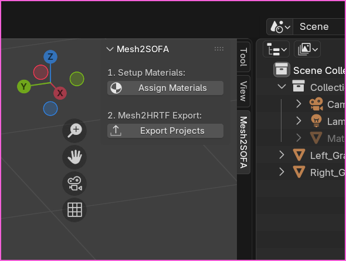

# Changelog

## 2026-05-31

**1. VTK Visualization Workflow** (Biggest change overall)
- **VTK Export:** Added `generate_vtk_outputs.py` to export pressure data from Mesh2HRTF simulations into VTK format.
- **GUI Integration:** Added a "Generate Paraview VTK Files" button and configuration dialog to the main Project Manager GUI.
- **Interactive VTK Viewer:** Introduced `_vtk_viewer.py`, a new PySide6-based application for visualizing simulation results. It features frequency selection, frequency averaging (the "Weight" slider averages multiple frequencies, with the number corresponding to +-n relative to the selected frequency), and adjustable dB scaling.

**2. Interactive Head Alignment Upgrade**
- **New PySide6 GUI:** Refactored `align_head.py` from a basic script to a full PySide6 GUI application. It now has a clear two-phase process: Phase 1 for precise point picking (ears/nose) and Phase 2 for interactive pitch (tilt) fine-tuning. Added a dedicated control panel with point capture history, real-time cursor markers, and confirmation spheres for better user experience.

**3. General GUI & Structural Refinements**
- **Extension Change:** Reverted `.pyw` extensions back to `.py` for `_project_manager_gui.py` and `_sofa_mastering_tool.py` to ensure better compatibility with certain python environments and debugging tools, but mainly to fix the issue of multiple terminal windows popping up during steps like running the numcalc simulation.
- **Asset Tracking:** Updated `.gitignore` to allow tracking of project screenshots (`.png` files) and added `screenshot_mesh2sofa.png`.

## 2026-05-26

**1. Project Structure & Tool Refinement**
- **Renamed Sofa Mastering Tool:** Renamed `sofa_mastering_tool.pyw` to `_sofa_mastering_tool.pyw` for consistency with the main project manager GUI's naming convention.
- **Blender Scripts Organization:** Moved all Blender-specific scripts into a dedicated `blender_scripts/` directory for better project organization.
- **Blender Add-on Conversion:** Updated `blender_export_project.py` to function as a proper installable Blender Add-on. It now provides a dedicated "Mesh2SOFA" panel in the 3D Viewport sidebar, replacing the previous workflow of running the script from Blender's text editor.

## 2026-05-09

**1. SOFA Mastering Improvements**
- **Temporal Alignment:** Added an automated onset detection and alignment step to `generate_sofa_outputs.py`. The HRIR peaks are now consistently shifted to sample index 32 prior to padding and cropping. This resolves an issue where delayed datasets (like the LISTEN dataset) were being improperly cropped, resulting in abnormal frequency responses.
- **Envelope Windowing:** Replaced the simple 16-sample trailing fade with a proper Hann windowing function (8-sample fade-in, 32-sample fade-out) to prevent spectral artifacts and better harmonize the HRIR duration.
- **Double-Length Option for Edge Cases:** Added a `--double-length` argument to `generate_sofa_outputs.py` which doubles the processing length to 1024 samples and output length to 512 samples to accommodate measured SOFA files with unusually long impulse responses. 

**2. Project Manager GUI (`_project_manager_gui.pyw`) Updates**
- **Extension Change:** Switched extension from `.py` to `.pyw` to prevent the console window from appearing during execution on Windows.
- **Tabbed Interface:** Introduced a new tabbed interface to separate App Settings from Project Settings for better organization.
- **Persistent Settings:** App settings are now saved to `app_settings.json` and persist across sessions.
- **Path Handling:** Improved file path handling logic for better cross-platform compatibility.

**3. Sofa Mastering Tool (`sofa_mastering_tool.pyw`) Updates**
- **Extension Change:** Switched extension from `.py` to `.pyw` to prevent the console window from appearing during execution on Windows.
- **Layout & Console:** Improved the overall layout and integrated a console output text box and an indeterminate progress bar directly into the UI for better visual feedback during execution.
- **DFHRTF Naming:** Added new naming options in the DFHRTF section, including a "Squigify Output" toggle (to optimize outputs for variancelog.squig.link) and a "Simulated" vs "Measured" tag toggle (also to help manage datasets on squig.link).
- **Double-Length Option:** Added a new "512 sample (edge case use only)" toggle to the Mastering Zone, which passes the `--double-length` flag down to the underlying python script. 

## 2026-05-03

**1. Sofa Mastering Tool Updates**
- Enabled horizontal window resizing.
- Improved the layout when working with multiple SOFA files by upgrading the file list display to a dynamic, wrapping text box that adjusts its height automatically.

## 2026-05-02

**1. Sofa Mastering Tool Updates**
- Added support for processing multiple SOFA files at once.
- Removed the standalone `batch_dfhrtf_gui.py` script as batch processing is now natively supported.
- Restructured SOFA Mastering and DFHRTF outputs sections.
- Added file prefix option for DFHRTF file outputs.
- When selecting "Same Folder" for outputs, mastered SOFA files are now saved to a `sofa_mastered` subfolder and DFHRTF files are saved to a `DFHRTF` subfolder.
- Removed setting for front spatial bias because it turns out not to be very useful.
- Updated `readme_sofa_mastering_tool.md` to reflect the new functionality.

## 2026-04-25

**1. Frequency Resolution Updates**
- Changed the "Standard" mode maximum frequency target from 21kHz to **18kHz** across the project.
- Updated `process_and_grade.py` to use a slightly finer intermediate mesh target (`target_mm_base = 0.6` instead of `0.65`).
- Updated `run_numcalc_test.py` to check simulation stability at index 120 (18kHz) instead of 140.

**2. Multi-Grid Support**
- **GUI (`_project_manager_gui.py`)**: Replaced the single-select combobox for Evaluation Grids with a new `GridSelectionDialog`. You can now select multiple grids at once using checkboxes.
- **Blender Export (`export_blender_project.py`)**: Updated the export script to support multiple selected grids, formatting the comma-separated selections into semicolons for Mesh2HRTF.

**3. DFHRTF Generation & Mastering Improvements**
- **Queueing (`_project_manager_gui.py`)**: Step 7 (Generate Extras) now automatically scans the output folder for *all* exported `48000Hz.sofa` files and queues them up sequentially, instead of hardcoding a single `HRIR_48000Hz.sofa` target.
- **Frontal Spatial Bias (`sofa_mastering_tool.py`)**: Added a new "Frontal Spatial Bias" slider (0.0 to 4.0) to the standalone Mastering Tool, passing the `--front_bias` parameter to the generation script. I thought this might be interesting for use with DFHRTF-based headphone equalization but will likely remvove this in a later release.
- **New Tool (`batch_dfhrtf_gui.py`)**: Added a batch tool for generating DFHRTF frequency response files from SOFA files,  specifically for processing publicly available SOFA repos such as SONICOM and HUTUBS (which I've published on variancelog.squig.link)

**4. Blender Script Stability**
- **`export_blender_project.py`**: Improved the method for duplicating the "Reference" mesh. It now safely copies the object data directly via `target_obj.copy()` instead of relying on Blender's sometimes finicky `bpy.ops` context overrides. (Prevents deletion of references meshes that was happening in some cases.)
